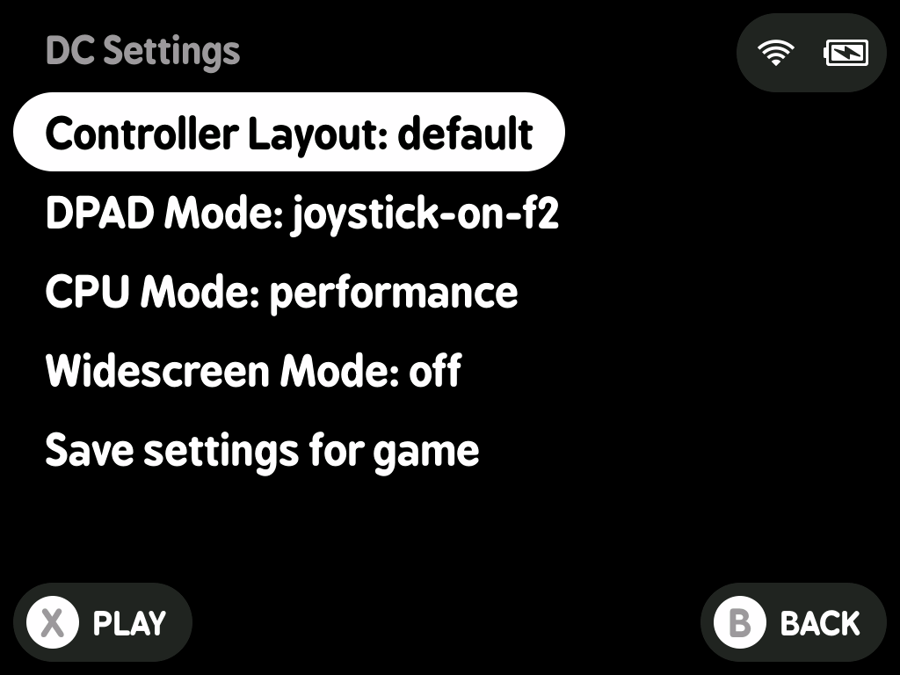

# minui-dreamcast.pak

A MinUI Emu Pak for Dreamcast, wrapping the standalone `flycast` N64 emulator (version `7d64554`).

## Requirements

This pak is designed and tested on the following MinUI Platforms and devices:

- `tg5040`: Trimui Brick (formerly `tg3040`)

Use the correct platform for your device.

## Installation

1. Mount your MinUI SD card.
2. Download the latest release from Github. It will be named `DC.pak.zip`.
3. Copy the zip file to `/Emus/$PLATFORM/DC.pak.zip`.
4. Extract the zip in place, then delete the zip file.
5. Confirm that there is a `/Emus/$PLATFORM/DC.pak/launch.sh` file on your SD card.
6. Create a folder at `/Roms/Sega Dreamcast (DC)` and place your roms in this directory.
7. Copy your BIOS files to `/BIOS/DC`. The paths are as follows
    1. Dreamcast: `/BIOS/DC/dc_boot.bin`
    2. Naomi: `/BIOS/DC/naomi.zip`
8. Unmount your SD Card and insert it into your MinUI device.

## Usage

Browse to `Sega Dreamcast` and press `A` to play a game.

The following filetypes are supported:

- Native: `.cdi`, `.chd`, `.cue and .bin`, `.gdi and .bin.`

### Controller Layouts

#### Default Controller Layout

Dreamcast Controller Keys:

| Hardware Button | Dreamcast Mapping |
|-----------------|-------------|
| `L1`            | `L`         |
| `R1`            | `R`         |
| `A`             | `B`         |
| `B`             | `A`         |
| `X`             | `Y`         |
| `Y`             | `X`         |

| Action                  | Hardware Combination   |
|-------------------------|------------------------|
| MinUI Menu Resume State | `X`                    |
| Quit Game               | `MENU`                 |
| Fast Forward            | `R2`                   |
| Load State              | `L3`, or `HOTKEY 1`    |
| Save State              | `R3`, or `HOTKEY 2`    |
| Screenshot              | `L2`                   |

### Emulator settings

To change emulator settings, press and hold the `R2` button while selecting/resuming a game to play. Hold R2 until a menu appears.

If the `B` or `MENU` buttons are pressed, the user is returned to the MinUI game selection screen. Settings are managed on a per-game basis, and can be saved for future gameplay, or the game can be started with the current settings as is.

#### Controller Layout

Allows changing between controller layouts.

- default: `default`
- options: `default`

#### CPU Mode

Allows changing the CPU Mode the emulator uses at runtime.

- default: `performance`
- options: `ondemand`, `performance`

#### DPAD Mode

Allows changing how the dpad is used in game.

- default: `dpad`
- options: `dpad`, `joystick`, `joystick and dpad`, `joystick on f2`

#### Widescreen Mode

> [!NOTE]
> See [this document](https://forums.launchbox-app.com/topic/65672-169-sega-dreamcast-via-flycast-norms-true-anamorphic-widescreen-project/) for details on how Dreamcast handles widescreen mode.

Allows toggling between widescreen modes

- default: `off`
- options: `off`, `on`, `cheat`

### Save states

In addition to in-game saves, this pak supports a single save state. Save states are stored in `$SDCARD_PATH/.userdata/shared/DC-flycast`

### Screenshots

Screenshots are written to `/Screenshots` with a sanitized version of the rom name as the screenshot prefix.

### Sleep Mode

Built-in MinUI cores have support for turning off the display and eventually shutting down when the power button is pressed. Standalone emulators do not have this functionality due to needing support inside of the console for this. At this time, this pak does not implement sleep mode.

### Debug Logging

To enable debug logging, create a file named debug in `$SDCARD_PATH/.userdata/$PLATFORM/DC-flycast` folder. Logs will be written to the`$SDCARD_PATH/.userdata/$PLATFORM/logs/` folder.

## Screenshots

| Name               | Image                                                     |
|--------------------|-----------------------------------------------------------|
| Emulator Settings  |  |
